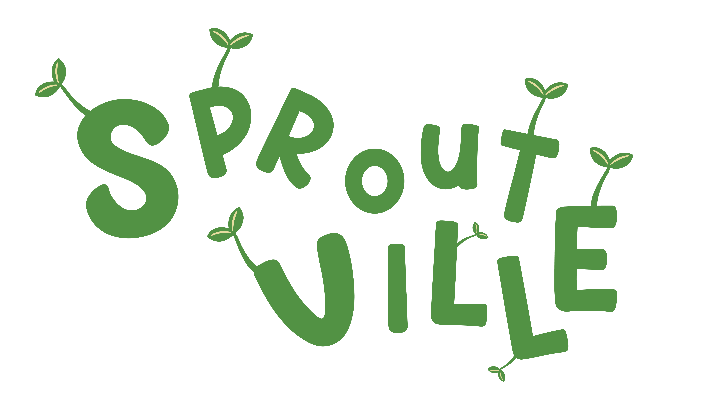
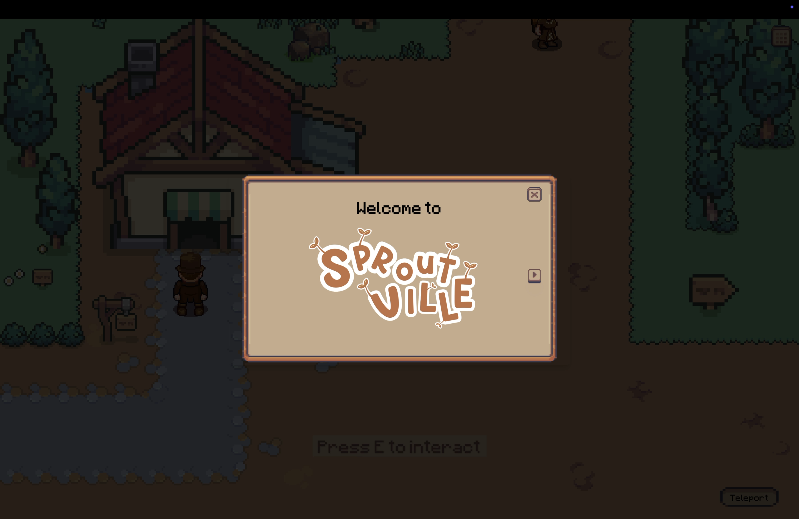
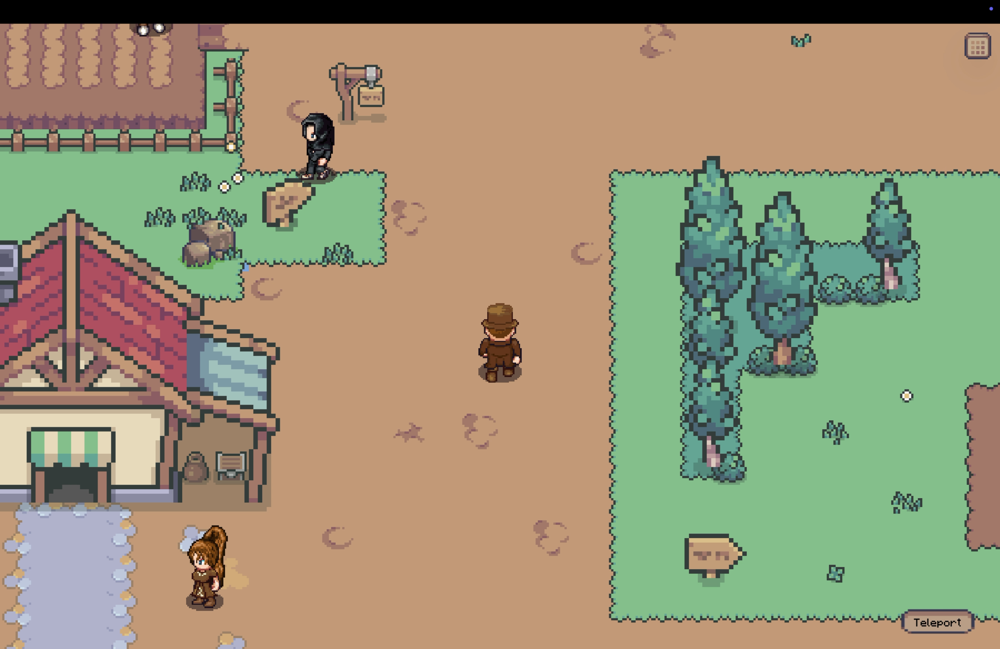
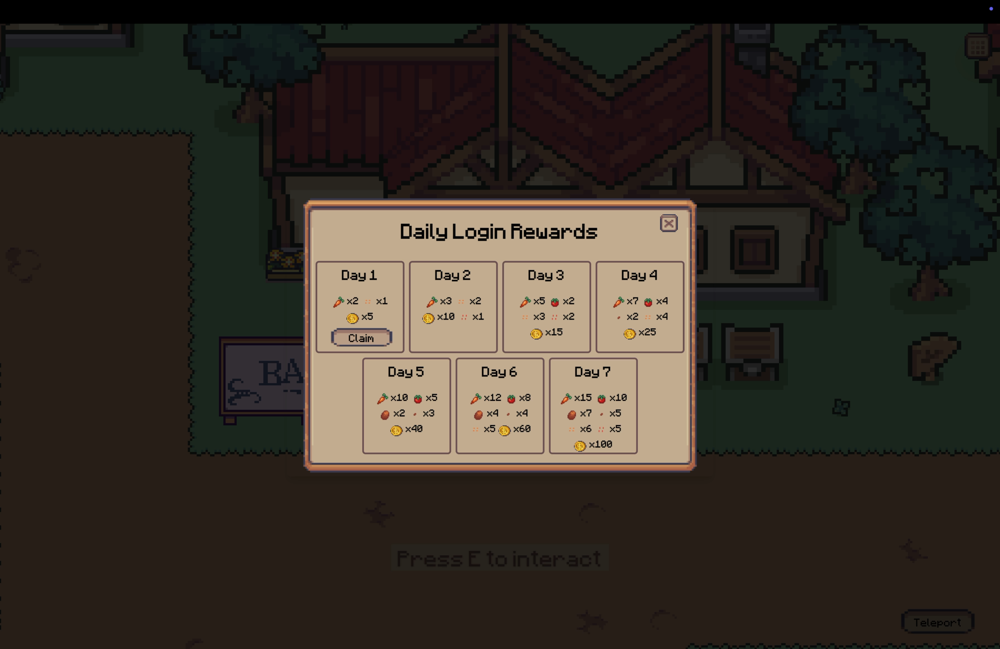
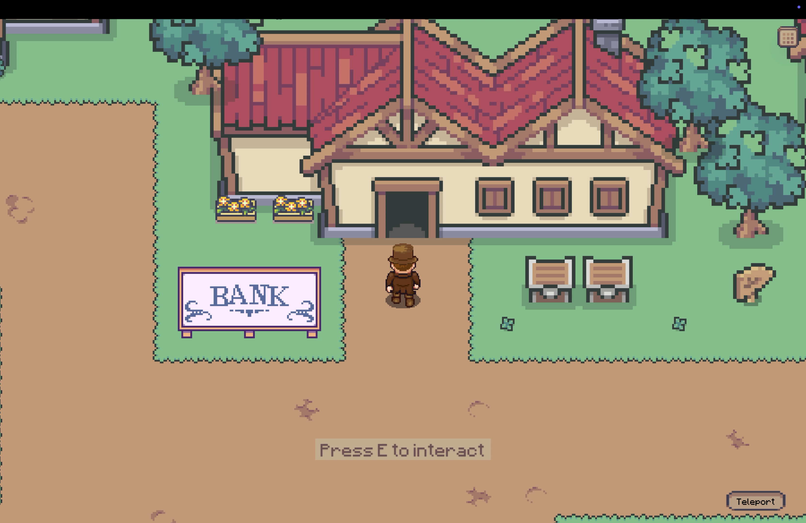
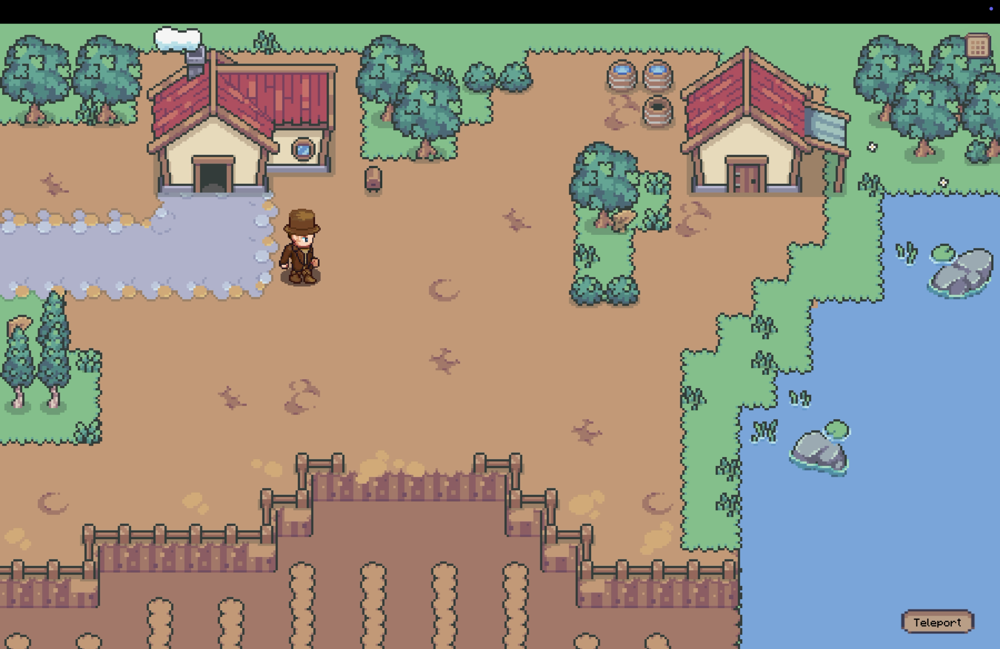
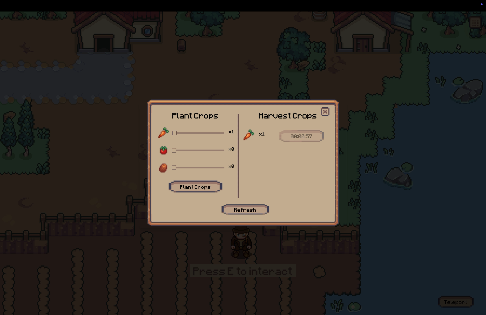
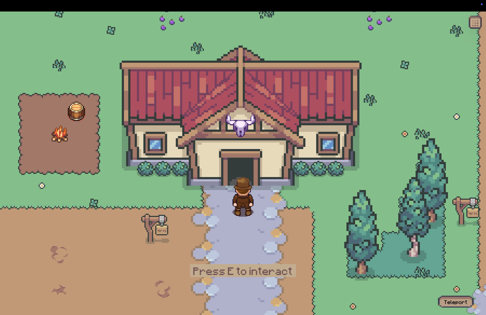
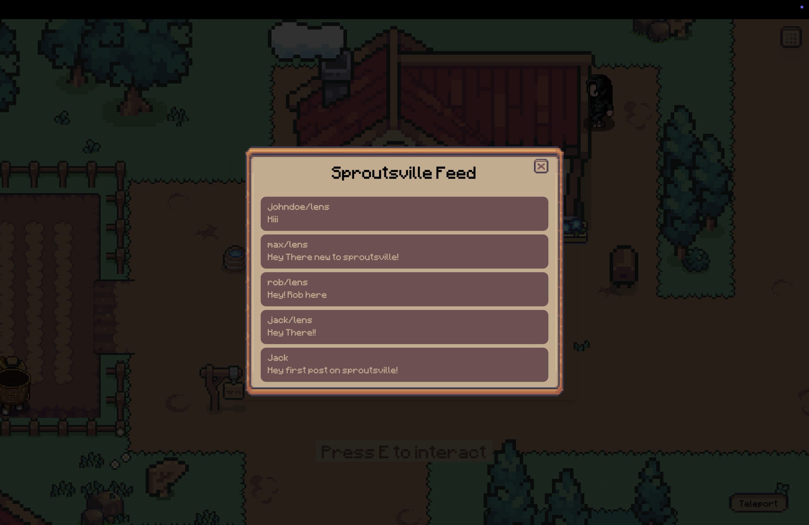
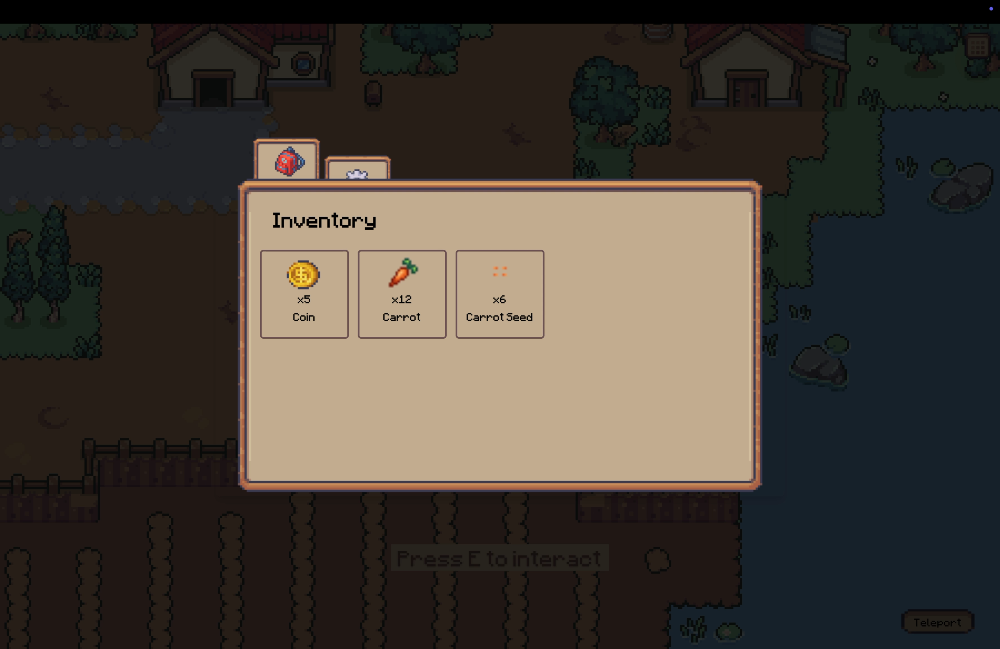

<p align="center">
</p>

Sproutsville is a 2D top-down farming game built with Phaser and designed to onboard new players into the Lens Protocol ecosystem, particularly Lens v3. The game blends fun farming mechanics with social interactions, creating an engaging experience that encourages players to "touch grass" in both the virtual and blockchain sense.

Players can grow crops, interact with NPCs, trade at the market, and participate in quests while exploring two vibrant villages:

- Main Village: A hub for Lens Protocol interactions, connecting players with the ecosystem.
  Player Village: A personal farming space where players can plant, harvest, and manage their resources.
- Sproutsville seamlessly integrates gameplay and blockchain mechanics to create a unique and enjoyable introduction to the Lens ecosystem.

## Architecture 🏗️

- Frontend: Built using Phaser for 2D game development.
- Backend: Electric PostgreSQL database with a modular schema to track player progress, inventory, quests, and village states.
- Integration: Lens Protocol (v3) for on-chain social interactions and player progression tracking.
- Economy System: Global and player economies are synced, with trade, quests, and daily loot systems.

## Demo Video 🎥

[](https://www.youtube.com/watch?v=IT1uPAZPyS0)

## Screenshots 📸

<table>
  <tr>
    <td valign="top" width="50%">
      <br>
      
    </td>
    <td valign="top" width="50%">
      <br>
      
    </td>
  </tr>
</table>

<table>
  <tr>
    <td valign="top" width="50%">
      <br>
            
    </td>
    <td valign="top" width="50%">
      <br>
            
    </td>
  </tr>
</table>

<table>
  <tr>
    <td valign="top" width="50%">
      <br>
            
    </td>
    <td valign="top" width="50%">
      <br>
            
    </td>
  </tr>
</table>

<table>
  <tr>
    <td valign="top" width="50%">
      <br>
            
    </td>
    <td valign="top" width="50%">
      <br>
            
    </td>
  </tr>
</table>

<table>
  <tr>
    <td valign="top" width="50%">
      <br>
            
    </td>
    <td valign="top" width="50%">
      <br>
            
    </td>
  </tr>
</table>

## 🎥 Demo Video

[](https://www.youtube.com/watch?v=video_id)

## Get Started 🚀

The following repository is a turborepo and divided into the following:

- **apps/web** - The web application built using vite.

First install the dependencies by running the following:

```

pnpm install

```

Then fill in the Environment variables in `apps/web/.env.local`

```bash
VITE_REOWN_PROJECT_ID=""
```

Then run the following command to start the application:

```bash
pnpm dev
```

---
